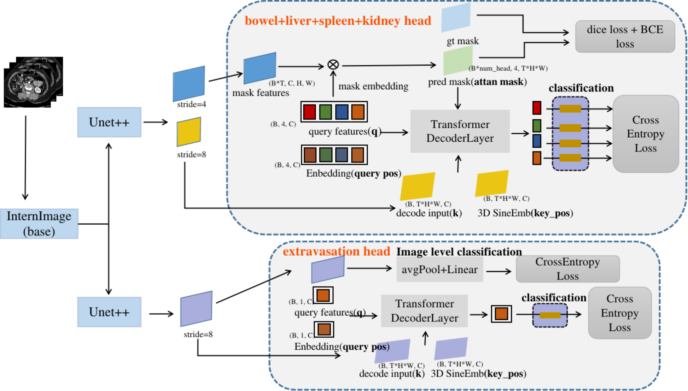

# RSNA 2023 Abdominal Trauma Detection Competition
My Solution is a 2.5D pipeline, model structure is as follows:


The segmentation masks are used as attention masks during decoding to help extract features of locations related to specific organs. But extravasation is an exception, which has no specific shape and position, so its decoding does not use segmentation masks, but instead adds a 2D image level classification head as an auxiliary.


Below you can find a outline of how to reproduce my solution for the <RSNA 2023 Abdominal Trauma Detection> competition.

##  HARDWARE

Ubuntu 20.04.6 LTS\
CPU specs: Intel(R) Xeon(R) Platinum 8160 CPU @ 2.10GHz\
number of CPU cores: 96\
memory: 256 GB

GPU specs: NVIDIA Corporation GV100GL [Tesla V100 SXM2 32GB] (rev a1)\
number of GPUs: 8


## SOFTWARE
Python    3.10.11\
CUDA    11.7\
nvidia drivers   515.105.01

#### Setup the environment :
`pip install -r requirements.txt`

#### compile the ops_dcnv3
 `cd ops_dcnv3`\
 `sh make.sh`\
 `cd ..`


## DATA SETUP
1. First determine the `root` and `process_root` in the `configs/setting.py`, **this step is essential, whether you want to train or test.**
2. download competition data from [there](https://www.kaggle.com/competitions/rsna-2023-abdominal-trauma-detection/data), unzip them, its directory is the `root` in `configs/setting.py`

3. download segmentation masks data from [HENGCK23's share](https://drive.google.com/drive/folders/11tCW2_huVJTWryfNgMFaLuP3Ll0XasNe), thanks for HENGCK23's share on [kaggel](https://www.kaggle.com/datasets/hengck23/total-segmentator-on-rsna-2023-abdominal-trauma?select=my-total-segmentator), and unzip them to the `process_root` in `configs/setting.py`

4. the data structure is as follows

```
root
├── train_images
└── test_images
└── segmentations
└── .csv  .parquet

process_root
├── my-total-segmentator

```

## DATA PROCESSING

### training process (You can skip this step if you only want to test)
1. convert dicom file to .png file to speed up training

    `python tools/data_preprocess/dicom_to_png.py`

2. generate segmentation mask's .png files with the same name as the images

    `python tools/data_preprocess/mask_to_png.py`

After running the data processing pipeline, structure should be :
```
root
├── train_images
└── test_images
└── segmentations
└── .csv .parquet

process_root
├── my-total-segmentator
└── train_images_png
└── train_masks_png
```

## How to train
train pipeline be determined by `./configs/atd_cfg_b.py`, it inherits from `_base_` and `setting.py`. You can modify the settings in `setting.py`, such as data `fold`, sequence scale `scale`, and the `data_version`. 

Must check if the `root` and `process_root` are correct, then run 

`sh tools/dist_train.sh`

Experiment records and model output will be stored in work_dirs.

## Trained Models 
[Here](https://drive.google.com/drive/folders/14avZb6KQrXOruEk-KebWphap38r24Ro1?usp=share_link) are several trained models, Please download and place them in the `checkpoints` directory

Each subdirectory has a weight file and a configuration file, with the following file structure:

```
checkpoints
├── atd_cfg_b_fold0_data_v2-0.0001-24x384x256-data_v2-fold_0
└   └── atd_cfg_b_fold0_data_v2.py
└   └── iter_1400.pth
└── atd_cfg_b_fold1_data_v2-0.0001-32x384x256-data_v2-fold_1
└   └── atd_cfg_b_fold1_data_v2.py
└   └── iter_1400.pth
└── atd_cfg_b_fold2_data_v2-0.0001-48x384x256-data_v2-fold_2
└   └── atd_cfg_b_fold2_data_v2.py
└   └── iter_1400.pth
```

you can set them in the `configs/setting.py`, Can refer to `How to predict` below.


## How to predict
the  `cfg_files_list` , `load_froms_list` in `configs/setting.py` defines the model used, you can change it if you trained new models.

After downloading the weight file as described above， then run 

`python submit.py` 

to predict, the results will in the `SUBMISSION_DIR`.


## directory structure
```
./configs                 # The most likely places to modify, regarding data, paths, models that need to be tested, etc.
./configs/_base_
./mm_custom               # codes about datasets and models
./mm_custom/datasets
./mm_custom/datasets/transforms
./mm_custom/models
./mm_custom/models/atd_nets
./mm_custom/models/backbones
./mm_custom/models/decode_heads
./mm_custom/models/neck
./mm_custom/evaluation

./tools           
./tools/data_preprocess       
./ops_dcnv3
./work_dirs         
./data
./data/processed   # Some intermediate files, such as weight files, train_val.csv files, etc.
./submit
./submission
```

## Submission scores
on the leadboard, my final submission is ensembled by ten models. The results are 

- public:  0.4084
- private:  0.4126 


This code repository is a modified and pure version. Three models were retrained and submitted. The results are:

- public:  0.4084
- private:  0.4126
